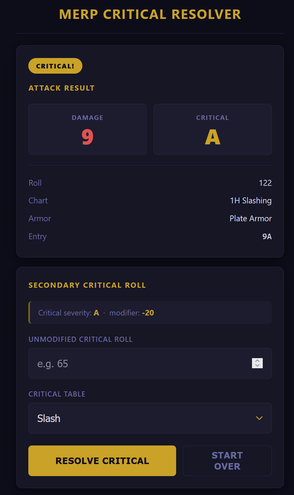

# MERP Critical Resolver

A mobile-first web app for resolving combat criticals in the *Middle Earth Role Playing* (MERP) tabletop RPG. Replaces looking up results across multiple printed tables with a fast three-step flow.



## How it works

1. **Primary attack** — enter your modified offensive bonus, select the attack chart and target armor type. The app looks up the result and shows hits and critical severity.
2. **Secondary critical roll** — if the attack scored a critical, enter the unmodified d100 roll. The app applies the severity modifier and looks up the effect.
3. **Resolution** — the critical description is displayed along with a full roll breakdown.

The app pre-fills the last used chart and armor type when you start a new attack.

## Running the app

The app uses `fetch()` to load data, so it must be served over HTTP — opening `index.html` directly as a `file://` URL will not work.

```bash
npx serve .
```

Then open `http://localhost:3000` in your browser (or phone).

## Project structure

```
index.html          single-page app
css/style.css       mobile-first dark-fantasy theme
js/app.js           all app logic
data/
  attack-charts.json   8 attack charts × 5 armor types
  criticals.json       11 critical effect tables
```

## Data

The JSON data files contain the entries from each of the eight attack charts (1H Slashing, 1H Concussion, 2H Weapon, Ball Spell, Bolt Spell, Grappling, Missile, Tooth & Claw) across five armor types. `data/criticals.json` contains the entries from each of the eleven critical tables (Cold, Crush, Electricity, Grappling, Heat, Impact, Physical Large, Puncture, Slash, Spell Large, Unbalancing).
